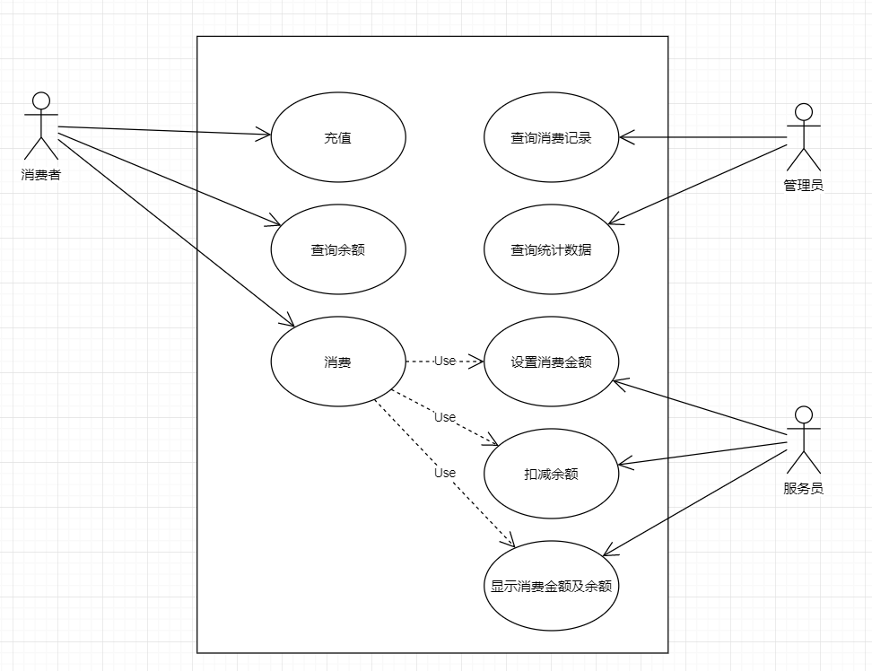
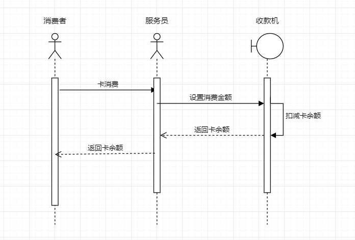
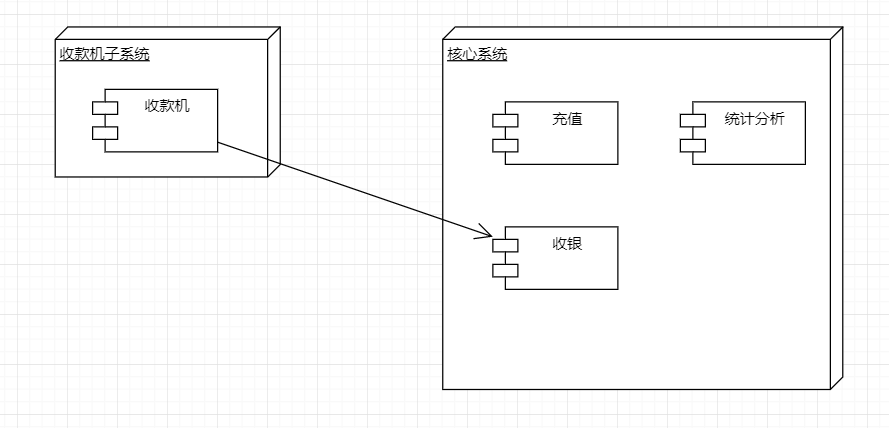
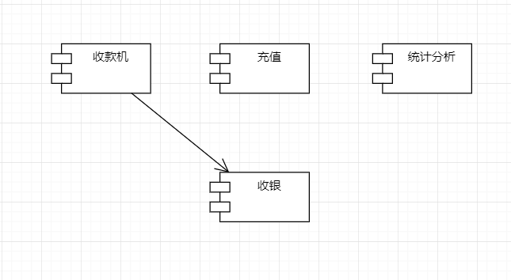
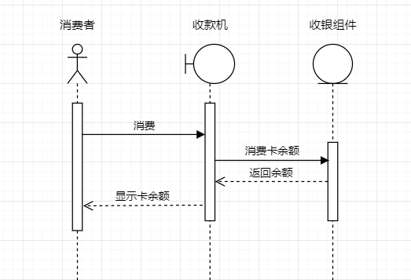

# 作业一：食堂就餐卡系统设计

- 系统中每个消费者都有一张卡，在管理中心注册缴费，卡内记着消费者的身份、余额。
- 使用时将卡插入收款机则显示卡上金额，服务员按收款机上数字键，收款机自动计算并显示消费额及余额。
- 管理中心的管理员监视每一笔消费，可打印出消费情况的相关统计数据。

请设计系统用例图，组件图，组件时序图，部署图。

## 设计概述

### 功能概述

系统主要功能包括就餐卡的充值与消费，以及消费记录的查询统计，查询统计结果支持打印。

使用者包括消费者、服务员、管理员三个角色。

### 非功能约束

系统预计消费者人数约1000人，服务员30人，管理员5人。

其中核心功能卡消费需支撑30个窗口同时使用，预计日订单3000。

1. 卡消费性能目标：平均响应时间<1s，95%响应时间<3s，TPS>60；

2. 充值性能⽬标：平均响应时间<3s，95%响应时间<5s，TPS>5； 

3. 统计分析性能⽬标：平均响应时间<3s，95%响应时间<5s，TPS>5； 

4. 系统核⼼功能可⽤性⽬标：>99.97%； 

5. 系统安全性⽬标：系统可拦截sql注入、csrf攻击，密码数据散列加密，客户端数据 HTTPS加密，外部系统间通信对称加密； 

6. 数据持久化⽬标：>99.99999%。 

### 卡消费场景业务时序图

1. 消费者刷卡消费时，由服务员操作收款机，设置消费金额完成刷卡。
2. 刷卡后，收款机显示刷卡金额和卡余额。

## 系统部署图与整体设计

系统上线时预计部署收款机30台，核心应用服务器1台。

### 系统部署图

1. 收款机作为终端，在收银场景下直接使用，各窗口部署1台收款机，共30台。使用时，只负责人机交互，具体的扣款功能通过调用核心系统的收银组件完成。

2. 核心系统负责就餐卡的实际收银计算，并提供充值及统计分析功能，部署1台应用服务器。

## 收款机子系统设计

采购硬件，完成接口对接。

## 核心系统设计

核心系统主要提供就餐卡的充值与消费功能，也提供对消费记录的统计分析功能。

主要包含充值组件、收银组件和统计分析组件，其中收银组件负责与收款机子系统对接。

### 核心系统组件图

1. 收款机组件为外部组件，负责收款数据的录入与收款结果的展示。
2. 收银组件为核心系统对外暴漏的接口，负责响应收款机的请求，计算收银结果，并返回结果给收款机。
3. 充值组件负责就餐卡的充值功能。
4. 统计分析组件负责消费数据的查询与统计分析功能。

#### 卡消费场景组件时序图

刷卡消费时，收款机设置消费金额并调用收银组件，收银组件接到请求后，保存消费记录，并返回卡余额，收款机显示卡余额。
