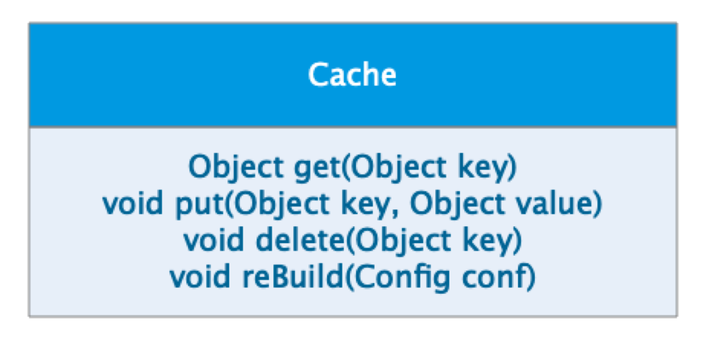

# 作业一

- 请描述什么是依赖倒置原则，为什么有时候依赖倒置原则又被称为好莱坞原则？

依赖倒置是高层依赖低层，但是接口规范由高层定义，低层负责按照规范进行实现。

好莱坞原则，don't call me, i will call you。

框架负责调用业务实现类，而非提供工具类给业务实现使用。

# 作业二

- 请描述一个你熟悉的框架，是如何实现依赖倒置原则的。

mybatis-plus，定义BaseMapper接口，业务实现此接口即可完成自定义Mapper。

# 作业三

- 请用接口隔离原则优化 Cache 类的设计，画出优化后的类图。
  
- **作业三提示**：cache 实现类中有四个方法，其中 put get delete 方法是需要暴露给应用程序的，rebuild 方法是需要暴露给系统进行远程调用的。如果将 rebuild 暴露给应用程序，应用程序可能会错误调用 rebuild 方法，导致 cache 服务失效。按照接口隔离原则：不应该强迫客户程序依赖它们不需要的方法。也就是说，应该使 cache 类实现两个接口，一个接口包含 get put delete 暴露给应用程序，一个接口包含 rebuild 暴露给系统远程调用。从而实现接口隔离，使应用程序看不到 rebuild 方法。

