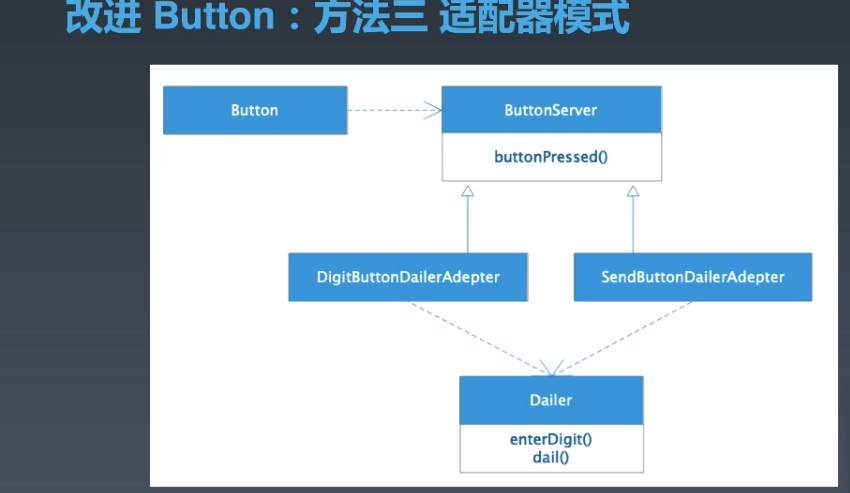
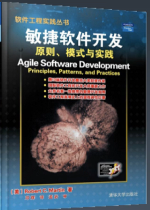

# 设计原则-SOLID

## 开闭原则(Open Closed Principle)

对修改封闭，对扩展开放

使用新增代码的方式完成对原有功能的扩展，不必在原需求简单的时候就过渡设计，但在需求变化时，尽量做到优雅实现，平时代码检查时，看到哪里觉得有问题，就可以着手重构了，一次只重构一点，也便于测试。

### 适配器模式

怎么判断用哪个Adapter呢

不用太过于关心适配器的选择，实际场景中，可以定义一个契约，来规定什么场景使用哪种适配器，而这个契约可能是一些命名规范，可能是一个配置文件，是方便扩展的。

### 监听模式

在button实例定义的时候定义button对应的处理方式，而非在Button定义的时候就统一定义好所有可预见的处理方式。类似于js中的处理，button.onClick。

## 依赖倒置(Dependency Inversion Principle)

A依赖B，但是标准由A来定义，B只负责实现。

对于框架来说，运行时，依赖于业务代码的实现，但标准需要框架来定义，业务部分需要按照标准来实现功能。

对于工具来说，运行时，是被依赖的，但也需要由工具来定义标准。

框架通常符合依赖倒置，工具不符合。

## 里氏替换原则(Liskov Substitution Principle)

可以使用父类的地方，一定可以使用子类来替换。

代入使用场景来判断，例如大马、小马皆为马，但在骑乘这个场景中却并不能替换。因此需要增加更多的父类或接口来解决这个问题，例如增加可骑乘马，不可骑乘马。但这种场景往往不是被依赖方（功能提供方）能够想周全的，因此需要依赖导致，由使用者来提需求，只关心我需要什么能力，我不需要的能力不用提供出来，也就是通过单一职责将功能拆散，或通过接口隔离来将无法拆散的功能屏蔽掉。

## 单一职责(Single Responsibility Principle)

一个类尽可能只专注于一个维度的功能，维度可以由使用者来定义。

## 接口隔离(Interface Segregation Principle)

如果一个类在实现上无法只基于一个维度，那么在对外暴漏时，尽可能只暴漏一个维度的方法，多个维度通过多个接口来暴漏。

# 推荐阅读

设计模式需要好好看一下